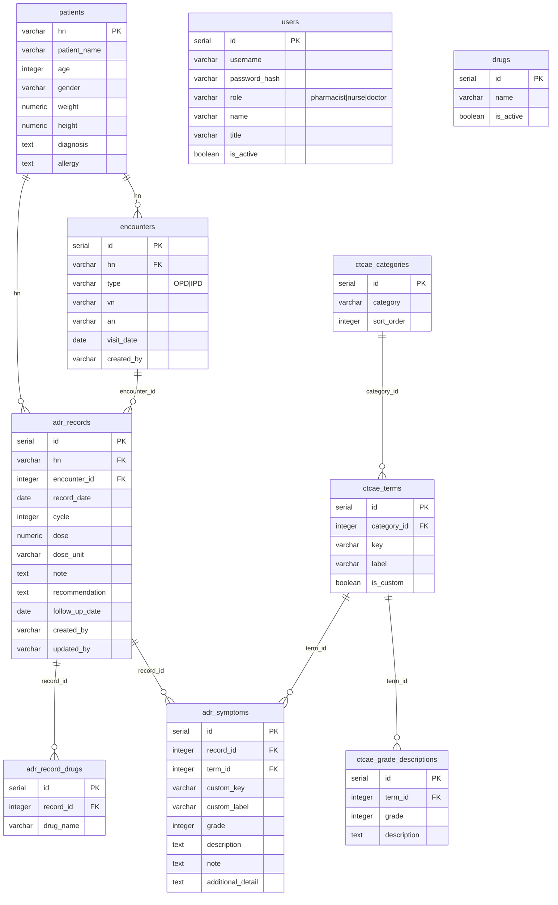

# 📋 ADR-T System — Database Schema & API Reference

> เอกสารนี้อธิบายโครงสร้างฐานข้อมูลและ API ทั้งหมดของระบบ  
> **Base URL**: `http://localhost:5000/api`  
> **Database**: PostgreSQL (Neon — ap-southeast-1)  
> **Auth**: Bearer JWT ส่งใน `Authorization` header ทุก request ยกเว้น `POST /api/auth/login`  
> **Content-Type**: `application/json`

---

## 🗄️ Database Tables

### 1. `patients` — ข้อมูลผู้ป่วย

| Column         | Type         | PK | Nullable | คำอธิบาย                                      |
|----------------|--------------|----|----------|-----------------------------------------------|
| `hn`           | VARCHAR      | ✅ | NO       | Hospital Number (Primary Key)                 |
| `patient_name` | VARCHAR(255) |    | NO       | ชื่อ-นามสกุลผู้ป่วย                           |
| `age`          | INTEGER      |    | YES      | อายุ (ปี)                                     |
| `gender`       | VARCHAR(20)  |    | YES      | เพศ เช่น `ชาย` / `หญิง`                      |
| `weight`       | NUMERIC      |    | YES      | น้ำหนัก (kg) — ใช้คำนวณ BSA ใน Step 1        |
| `height`       | NUMERIC      |    | YES      | ส่วนสูง (cm) — ใช้คำนวณ BSA ใน Step 1        |
| `diagnosis`    | TEXT         |    | YES      | การวินิจฉัยโรค เช่น `Breast Cancer Stage III` |
| `allergy`      | TEXT         |    | YES      | ประวัติแพ้ยา                                   |
| `created_at`   | TIMESTAMP    |    | YES      | วันที่เพิ่มข้อมูล (default: NOW())             |
| `updated_at`   | TIMESTAMP    |    | YES      | วันที่อัปเดตล่าสุด                             |

> `ON CONFLICT (hn) DO NOTHING` — ไม่ทับข้อมูลเดิมเมื่อ HN ซ้ำ

---

### 2. `users` — ผู้ใช้งานระบบ

| Column          | Type         | PK | Nullable | คำอธิบาย                                                  |
|-----------------|--------------|----|----------|-----------------------------------------------------------|
| `id`            | SERIAL       | ✅ | NO       | Auto-increment ID                                         |
| `username`      | VARCHAR(100) |    | NO       | ชื่อผู้ใช้งาน (unique)                                    |
| `password_hash` | VARCHAR(255) |    | NO       | รหัสผ่านที่เข้ารหัสด้วย bcrypt                            |
| `role`          | VARCHAR(50)  |    | NO       | บทบาท: `pharmacist` / `nurse` / `doctor`                 |
| `name`          | VARCHAR(255) |    | YES      | ชื่อแสดงผล                                                |
| `title`         | VARCHAR(100) |    | YES      | ตำแหน่ง เช่น `เภสัชกร` / `พยาบาล` / `แพทย์`             |
| `is_active`     | BOOLEAN      |    | YES      | สถานะใช้งาน (default: true)                               |

---

### 3. `encounters` — การมาพบแพทย์

| Column       | Type         | PK | Nullable | คำอธิบาย                                       |
|--------------|--------------|----|----------|------------------------------------------------|
| `id`         | SERIAL       | ✅ | NO       | Auto-increment ID                              |
| `hn`         | VARCHAR      |    | NO       | FK → `patients.hn`                             |
| `type`       | VARCHAR(10)  |    | NO       | ประเภท: `OPD` / `IPD`                          |
| `vn`         | VARCHAR(100) |    | YES      | Visit Number (OPD) รูปแบบ `VN-{timestamp}`    |
| `an`         | VARCHAR(100) |    | YES      | Admission Number (IPD) รูปแบบ `AN-{timestamp}` |
| `visit_date` | DATE         |    | NO       | วันที่มาพบแพทย์                                 |
| `created_by` | VARCHAR      |    | YES      | `users.id` ผู้สร้าง                            |
| `created_at` | TIMESTAMP    |    | YES      | วันที่สร้าง (default: NOW())                    |

---

### 4. `adr_records` — บันทึก ADR (หัวรายการ)

| Column           | Type        | PK | Nullable | คำอธิบาย                                   |
|------------------|-------------|----|----------|--------------------------------------------|
| `id`             | SERIAL      | ✅ | NO       | Auto-increment ID                          |
| `hn`             | VARCHAR     |    | NO       | FK → `patients.hn`                         |
| `encounter_id`   | INTEGER     |    | YES      | FK → `encounters.id`                       |
| `record_date`    | DATE        |    | NO       | วันที่บันทึก ADR                            |
| `cycle`          | INTEGER     |    | YES      | รอบการรักษา                                 |
| `dose`           | NUMERIC     |    | YES      | ขนาดยาที่ใช้                                |
| `dose_unit`      | VARCHAR(50) |    | YES      | หน่วยของยา เช่น `mg/m²` / `mg/kg` / `mg`  |
| `note`           | TEXT        |    | YES      | หมายเหตุเพิ่มเติม                           |
| `recommendation` | TEXT        |    | YES      | คำแนะนำ / การจัดการ                         |
| `follow_up_date` | DATE        |    | YES      | วันนัดติดตาม                                |
| `created_by`     | VARCHAR     |    | YES      | `users.id` ผู้บันทึก                        |
| `updated_by`     | VARCHAR     |    | YES      | `users.id` ผู้แก้ไขล่าสุด                   |
| `created_at`     | TIMESTAMP   |    | YES      | วันที่สร้าง                                 |
| `updated_at`     | TIMESTAMP   |    | YES      | วันที่อัปเดตล่าสุด                          |

---

### 5. `adr_record_drugs` — รายการยาใน ADR Record

| Column      | Type         | PK | Nullable | คำอธิบาย                                   |
|-------------|-------------|-----|----------|--------------------------------------------|
| `id`        | SERIAL       | ✅ | NO       | Auto-increment ID                          |
| `record_id` | INTEGER      |    | NO       | FK → `adr_records.id` (CASCADE DELETE)     |
| `drug_name` | VARCHAR(255) |    | NO       | ชื่อยา (free text หรือจาก `drugs.name`)    |

---

### 6. `adr_symptoms` — รายการอาการ ADR

| Column              | Type         | PK | Nullable | คำอธิบาย                                        |
|---------------------|--------------|----|----------|-------------------------------------------------|
| `id`                | SERIAL       | ✅ | NO       | Auto-increment ID                               |
| `record_id`         | INTEGER      |    | NO       | FK → `adr_records.id` (CASCADE DELETE)          |
| `term_id`           | INTEGER      |    | YES      | FK → `ctcae_terms.id` (null ถ้าเป็น custom)     |
| `custom_key`        | VARCHAR(255) |    | YES      | Key อาการ custom (ถ้าไม่ใช่ CTCAE มาตรฐาน)      |
| `custom_label`      | VARCHAR(255) |    | YES      | ชื่ออาการ custom                                |
| `grade`             | INTEGER      |    | NO       | ระดับความรุนแรง Grade 1–5                       |
| `description`       | TEXT         |    | YES      | คำอธิบายอาการ (ตาม grade definition)            |
| `note`              | TEXT         |    | YES      | หมายเหตุเพิ่มเติม                               |
| `additional_detail` | TEXT         |    | YES      | รายละเอียดเพิ่มเติม เช่น ค่าแล็บ               |

> การ upsert: `DELETE FROM adr_symptoms WHERE record_id = $1` ก่อน แล้ว insert ใหม่ทุกครั้ง

---

### 7. `ctcae_categories` — หมวดหมู่ CTCAE

| Column       | Type         | PK | Nullable | คำอธิบาย                          |
|--------------|--------------|----|----------|-----------------------------------|
| `id`         | SERIAL       | ✅ | NO       | Auto-increment ID                 |
| `category`   | VARCHAR(255) |    | NO       | ชื่อหมวด เช่น `Blood`, `GI`      |
| `sort_order` | INTEGER      |    | YES      | ลำดับการแสดงผล                    |

---

### 8. `ctcae_terms` — รายการอาการ CTCAE

| Column        | Type         | PK | Nullable | คำอธิบาย                                       |
|---------------|-------------|-----|----------|------------------------------------------------|
| `id`          | SERIAL       | ✅ | NO       | Auto-increment ID                              |
| `category_id` | INTEGER      |    | NO       | FK → `ctcae_categories.id`                     |
| `key`         | VARCHAR(255) |    | NO       | Unique key เช่น `anemia`, `nausea`             |
| `label`       | VARCHAR(255) |    | NO       | ชื่อแสดงผล เช่น `Anemia`, `Nausea`            |
| `is_custom`   | BOOLEAN      |    | YES      | เป็น term ที่เพิ่มเองหรือไม่ (default: false)  |

---

### 9. `ctcae_grade_descriptions` — คำอธิบาย Grade

| Column        | Type    | PK | Nullable | คำอธิบาย                       |
|---------------|---------|----|----------|--------------------------------|
| `id`          | SERIAL  | ✅ | NO       | Auto-increment ID              |
| `term_id`     | INTEGER |    | NO       | FK → `ctcae_terms.id`          |
| `grade`       | INTEGER |    | NO       | ระดับ 1–5                      |
| `description` | TEXT    |    | YES      | คำอธิบายตาม CTCAE standard     |

---

### 10. `drugs` — รายการยา (Drug Master)

| Column      | Type         | PK | Nullable | คำอธิบาย                    |
|-------------|-------------|-----|----------|-----------------------------|
| `id`        | SERIAL       | ✅ | NO       | Auto-increment ID           |
| `name`      | VARCHAR(255) |    | NO       | ชื่อยา (unique)              |
| `is_active` | BOOLEAN      |    | YES      | สถานะใช้งาน (default: true)  |

> ใช้ populate dropdown ใน Step 1 ทั้งหมด  
> ผู้ใช้เพิ่มยานอกบัญชีได้ผ่านปุ่ม "เพิ่มยานอกบัญชี" ซึ่งเรียก `POST /api/drugs` และบันทึกถาวรลง table นี้

---

### 11. `view_adr_summary` — View สรุป ADR

View นี้ JOIN ข้อมูลจาก `adr_records`, `patients`, `encounters`, `adr_symptoms`, `adr_record_drugs` ใช้ใน `GET /api/records` และ `GET /api/records/:id`

| Column                  | คำอธิบาย                                        |
|-------------------------|------------------------------------------------|
| `id`                    | adr_records.id                                 |
| `hn`                    | HN ผู้ป่วย                                      |
| `patient_name`          | ชื่อผู้ป่วย                                      |
| `diagnosis`             | การวินิจฉัย                                      |
| `record_date`           | วันที่บันทึก                                     |
| `cycle`                 | รอบการรักษา                                      |
| `dose` / `dose_unit`    | ขนาดยาและหน่วย                                  |
| `note`                  | หมายเหตุ                                        |
| `recommendation`        | คำแนะนำ                                         |
| `follow_up_date`        | วันนัดติดตาม                                     |
| `drugs`                 | array ชื่อยา                                     |
| `max_grade`             | grade สูงสุดของ record นั้น                       |
| `symptom_count`         | จำนวนอาการทั้งหมด                                |
| `grade3_plus_count`     | จำนวนอาการ grade ≥ 3                             |
| `symptoms`              | JSONB สรุปอาการทุก symptom                       |
| `encounter_id`          | ID ของ encounter                                |
| `encounter_type`        | `OPD` / `IPD`                                  |
| `created_by`            | users.id ผู้บันทึก                               |
| `created_at`            | วันที่สร้าง                                      |
| `updated_at`            | วันที่อัปเดตล่าสุด                               |

---

## 🔌 API Endpoints

> ทุก endpoint ยกเว้น `POST /api/auth/login` ต้องส่ง `Authorization: Bearer <token>`

---

### AUTH

| Method | Endpoint          | Auth | Role     | คำอธิบาย               |
|--------|-------------------|------|----------|------------------------|
| POST   | `/api/auth/login` | ❌   | ทุก role | เข้าสู่ระบบ             |
| GET    | `/api/auth/me`    | ✅   | ทุก role | ดึงข้อมูล user ปัจจุบัน |

**POST `/api/auth/login`**

Request body:
```json
{ "username": "pharmacist01", "password": "secret" }
```

Response `200 OK`:
```json
{
  "token": "eyJ...",
  "user": { "id": 1, "role": "pharmacist", "name": "ภญ.สมใจ", "title": "เภสัชกร" }
}
```

> Token มีอายุ **8 ชั่วโมง** (กำหนดใน `JWT_EXPIRES`)  
> `role` ที่เป็นไปได้: `pharmacist` / `nurse` / `doctor`  
> ระบบ query `WHERE username = $1 AND is_active = TRUE` และ verify ด้วย bcrypt

Error responses:
```
400 { "message": "กรุณาระบุ username และ password" }
401 { "message": "Username หรือ Password ไม่ถูกต้อง" }
```

**GET `/api/auth/me`**

Response `200 OK`:
```json
{ "id": 1, "username": "pharmacist01", "role": "pharmacist", "name": "ภญ.สมใจ", "title": "เภสัชกร" }
```

---

### PATIENTS — ผู้ป่วย

| Method | Endpoint            | Role       | คำอธิบาย                  |
|--------|---------------------|------------|---------------------------|
| GET    | `/api/patients`     | ทุก role   | ดึงรายชื่อผู้ป่วย / ค้นหา  |
| GET    | `/api/patients/:hn` | ทุก role   | ดึงข้อมูลผู้ป่วยรายบุคคล   |
| POST   | `/api/patients`     | pharmacist | เพิ่มผู้ป่วยใหม่            |
| PUT    | `/api/patients/:hn` | pharmacist | แก้ไขข้อมูลผู้ป่วย          |

**GET `/api/patients?q=`**

| Param | Type   | คำอธิบาย                                          |
|-------|--------|---------------------------------------------------|
| `q`   | string | ค้นหาจาก HN หรือชื่อ (ILIKE `%q%`) — optional    |

Response `200 OK`:
```json
[
  {
    "hn": "67001",
    "patient_name": "นางสาวสมหญิง ใจดี",
    "age": 52,
    "gender": "หญิง",
    "weight": 58,
    "height": 162,
    "diagnosis": "Breast Cancer Stage III HER2+",
    "allergy": null,
    "created_at": "2025-01-10T08:00:00.000Z",
    "updated_at": null
  }
]
```

**GET `/api/patients/:hn`**

Response `200 OK` — patient object เดียว (shape เดียวกับด้านบน)

```
404 { "message": "ไม่พบผู้ป่วย HN: 67001" }
```

**POST `/api/patients`** *(pharmacist only)*

Required fields: `hn`, `patient_name`

Request body:
```json
{
  "hn": "67001",
  "patient_name": "นางสาวสมหญิง ใจดี",
  "age": 52,
  "gender": "หญิง",
  "weight": 58,
  "height": 162,
  "diagnosis": "Breast Cancer Stage III HER2+"
}
```

Response `201 Created`:
```json
{ "message": "เพิ่มผู้ป่วยสำเร็จ", "patient": { ...patient object } }
```

```
409 { "message": "HN 67001 มีอยู่ในระบบแล้ว" }
```

**PUT `/api/patients/:hn`** *(pharmacist only)*

Request body: fields เดียวกับ POST ยกเว้น `hn` (อยู่ใน path param)

Response `200 OK`:
```json
{ "message": "อัปเดตข้อมูลผู้ป่วยสำเร็จ", "patient": { ...patient object } }
```

---

### DRUGS — รายการยา

| Method | Endpoint     | Role     | คำอธิบาย                                |
|--------|--------------|----------|-----------------------------------------|
| GET    | `/api/drugs` | ทุก role | ดึงรายการยา active ทั้งหมด               |
| POST   | `/api/drugs` | ทุก role | เพิ่มยานอกบัญชีใหม่ บันทึกถาวรลง DB     |

**GET `/api/drugs`**

Response `200 OK` — array เรียงตามชื่อ alphabetically:
```json
[
  { "id": 1, "name": "Carboplatin" },
  { "id": 2, "name": "Docetaxel" },
  { "id": 3, "name": "Paclitaxel" }
]
```

> Frontend โหลด array นี้ทั้งหมดตอน Step 1 mount แล้ว filter ฝั่ง client เอง  
> ไม่มีการ query ซ้ำเมื่อผู้ใช้พิมพ์ค้นหา

**POST `/api/drugs`**

Request body:
```json
{ "name": "Pembrolizumab" }
```

Response `201 Created`:
```json
{ "id": 42, "name": "Pembrolizumab", "is_active": true }
```

```
400 { "message": "กรุณาระบุชื่อยา" }
409 { "message": "ยานี้มีอยู่ในระบบแล้ว" }
```

> ใช้ `ON CONFLICT (name) DO NOTHING` — ชื่อยาต้อง unique  
> เรียกจาก Step1.jsx เมื่อผู้ใช้กดปุ่ม "เพิ่มยานอกบัญชี"

---

### CTCAE

| Method | Endpoint           | Role     | คำอธิบาย                                       |
|--------|--------------------|----------|------------------------------------------------|
| GET    | `/api/ctcae`       | ทุก role | ดึงข้อมูล CTCAE ทั้งหมด จัดกลุ่มตาม category  |
| GET    | `/api/ctcae/terms` | ทุก role | ดึง term list แบบ flat array                   |

**GET `/api/ctcae?q=`**

| Param | Type   | คำอธิบาย                                       |
|-------|--------|------------------------------------------------|
| `q`   | string | ค้นหาจาก `key` หรือ `label` (ILIKE) — optional |

Response `200 OK`:
```json
[
  {
    "category": "Blood",
    "terms": [
      {
        "id": 1,
        "key": "anemia",
        "label": "Anemia",
        "isCustom": false,
        "options": [
          { "grade": 1, "description": "Hemoglobin <LLN - 10.0 g/dL" },
          { "grade": 2, "description": "Hgb <10.0 - 8.0 g/dL" },
          { "grade": 3, "description": "Hgb <8.0 g/dL; transfusion indicated" },
          { "grade": 4, "description": "Life-threatening consequences" },
          { "grade": 5, "description": "Death" }
        ]
      }
    ]
  }
]
```

> JOIN `ctcae_terms` + `ctcae_categories` + `ctcae_grade_descriptions`  
> Group by category เรียงตาม `sort_order`

**GET `/api/ctcae/terms?q=`** — flat array ไม่มี options

Response `200 OK`:
```json
[
  { "id": 1, "key": "anemia", "label": "Anemia", "is_custom": false, "category": "Blood" }
]
```

---

### ENCOUNTERS — การมาพบแพทย์

| Method | Endpoint              | Role     | คำอธิบาย                          |
|--------|-----------------------|----------|-----------------------------------|
| POST   | `/api/encounters`     | ทุก role | สร้าง encounter ใหม่ (OPD/IPD)    |
| GET    | `/api/encounters?hn=` | ทุก role | ดึง encounter ทั้งหมดของผู้ป่วย   |

**POST `/api/encounters`**

Required fields: `hn`, `type`, `visit_date`

Request body:
```json
{
  "hn": "67001",
  "type": "OPD",
  "visit_date": "2025-06-01"
}
```

Response `201 Created`:
```json
{
  "message": "สร้าง encounter สำเร็จ",
  "encounter": {
    "id": 42,
    "hn": "67001",
    "type": "OPD",
    "vn": "VN-1717200000000",
    "an": null,
    "visit_date": "2025-06-01",
    "created_by": 1,
    "created_at": "2025-06-01T08:00:00.000Z"
  }
}
```

> `vn` สร้างอัตโนมัติด้วย `VN-{Date.now()}` สำหรับ OPD  
> `an` สร้างอัตโนมัติด้วย `AN-{Date.now()}` สำหรับ IPD

**GET `/api/encounters?hn=67001`**

Response `200 OK` — array เรียง `visit_date DESC`:
```json
[
  { "id": 42, "hn": "67001", "type": "OPD", "vn": "VN-...", "an": null, "visit_date": "2025-06-01", "created_by": 1, "created_at": "..." }
]
```

---

### ADR RECORDS — บันทึก ADR

| Method | Endpoint           | Role       | คำอธิบาย                      |
|--------|--------------------|------------|-------------------------------|
| GET    | `/api/records`     | ทุก role   | ดึง ADR records (filter ได้)  |
| GET    | `/api/records/:id` | ทุก role   | ดึง record รายบุคคล            |
| POST   | `/api/records`     | ทุก role   | บันทึก ADR record ใหม่         |
| PUT    | `/api/records/:id` | pharmacist | แก้ไข ADR record               |
| DELETE | `/api/records/:id` | pharmacist | ลบ ADR record                  |

**GET `/api/records`** — Query Params:

| Param   | Type   | Format    | คำอธิบาย                                      |
|---------|--------|-----------|-----------------------------------------------|
| `hn`    | string |           | กรองตาม HN — optional                         |
| `month` | string | `YYYY-MM` | กรองตามเดือน — optional                       |
| `year`  | string | `YYYY`    | กรองทั้งปี ใช้ใน Report page — optional       |
| `grade` | number | `1`–`5`   | กรอง record ที่ max_grade ≥ ค่านี้ — optional |
| `q`     | string |           | ค้นหาจาก HN หรือชื่อ — optional              |

Response `200 OK` — array of records:
```json
[
  {
    "id": 101,
    "hn": "67001",
    "patient_name": "นางสาวสมหญิง ใจดี",
    "diagnosis": "Breast Cancer Stage III HER2+",
    "record_date": "2025-06-01",
    "cycle": 3,
    "dose": 120,
    "dose_unit": "mg/m²",
    "note": "ผู้ป่วยทนยาได้ปานกลาง",
    "recommendation": "ให้ antiemetic เพิ่ม",
    "follow_up_date": "2025-06-15",
    "drugs": ["Docetaxel", "Carboplatin"],
    "max_grade": 2,
    "symptom_count": 2,
    "grade3_plus_count": 0,
    "symptoms": {
      "anemia": { "grade": 2, "label": "Anemia", "description": "Hgb <10.0 - 8.0 g/dL" }
    },
    "encounter_id": 42,
    "encounter_type": "OPD",
    "vn": "VN-1717200000000",
    "an": null,
    "created_by": 1,
    "created_at": "2025-06-01T08:30:00.000Z",
    "updated_at": null,
    "symptomsDetail": [
      {
        "id": 201,
        "record_id": 101,
        "term_id": 5,
        "term_key": "anemia",
        "term_label": "Anemia",
        "grade": 2,
        "description": "Hgb <10.0 - 8.0 g/dL",
        "note": "Hgb 9.2",
        "additional_detail": null,
        "custom_key": null,
        "custom_label": null
      }
    ]
  }
]
```

> `symptoms` (JSONB จาก view) ใช้สำหรับ Report page ที่คำนวณ client-side  
> `symptomsDetail` (array) ใช้สำหรับ Recorddetail.jsx ที่ต้องแสดงรายละเอียดครบ

**GET `/api/records/:id`**

Response shape เหมือน GET /api/records แต่ return object เดียว

```
404 { "message": "ไม่พบ record ID: 101" }
```

**POST `/api/records`**

Required fields: `hn`, `record_date`

Request body:
```json
{
  "hn": "67001",
  "encounter_id": 42,
  "record_date": "2025-06-01",
  "cycle": 3,
  "dose": 120,
  "dose_unit": "mg/m²",
  "drugs": ["Docetaxel", "Carboplatin"],
  "symptoms": {
    "anemia": {
      "grade": 2,
      "description": "Hgb <10.0 - 8.0 g/dL",
      "label": "Anemia",
      "note": "Hgb 9.2",
      "additionalDetail": "",
      "isCustom": false
    },
    "custom_rash_001": {
      "grade": 1,
      "description": "ผื่นแดงเล็กน้อย",
      "label": "Rash (custom)",
      "note": "",
      "isCustom": true
    }
  },
  "note": "ผู้ป่วยทนยาได้ปานกลาง",
  "recommendation": "ให้ antiemetic เพิ่ม",
  "follow_up_date": "2025-06-15"
}
```

> ถ้าไม่ส่ง `encounter_id` ระบบหา encounter ล่าสุดของ HN ที่ `visit_date` ตรงกับ `record_date` อัตโนมัติ  
> symptom ที่ `isCustom: true` → insert เป็น `custom_key` / `custom_label`  
> symptom ที่ `isCustom: false` → lookup `term_id` จาก `ctcae_terms.key`

Response `201 Created`:
```json
{ "message": "บันทึกข้อมูลสำเร็จ", "id": 101 }
```

**PUT `/api/records/:id`** *(pharmacist only)*

Request body — fields ที่แก้ไขได้ (ไม่เปลี่ยน hn / record_date):
```json
{
  "cycle": 4,
  "dose": 130,
  "dose_unit": "mg/m²",
  "drugs": ["Docetaxel"],
  "symptoms": { ... },
  "note": "อัปเดตหมายเหตุ",
  "recommendation": "ปรับยา",
  "follow_up_date": "2025-07-01"
}
```

Response `200 OK`: `{ "message": "อัปเดตข้อมูลสำเร็จ" }`

> ทำใน transaction: UPDATE header → DELETE+INSERT drugs → DELETE+INSERT symptoms

**DELETE `/api/records/:id`** *(pharmacist only)*

Response `200 OK`: `{ "message": "ลบข้อมูลสำเร็จ" }`

---

### STATS — Dashboard

| Method | Endpoint     | Role     | คำอธิบาย                    |
|--------|--------------|----------|-----------------------------|
| GET    | `/api/stats` | ทุก role | ดึงสถิติสรุปสำหรับ Dashboard |

**GET `/api/stats?month=YYYY-MM`**

| Param   | Type   | คำอธิบาย                                        |
|---------|--------|-------------------------------------------------|
| `month` | string | รูปแบบ `YYYY-MM` — ถ้าไม่ส่งใช้เดือนปัจจุบัน   |

Response `200 OK`:
```json
{
  "month": "2025-06",
  "totalRecords": 48,
  "totalADR": 112,
  "uniquePatients": 35,
  "adrRate": 2.3333,
  "grade3Events": 8,
  "grade3Rate": 16.67,
  "gradeDist": { "1": 55, "2": 40, "3": 12, "4": 4, "5": 1 },
  "topSymptoms": [
    { "name": "Nausea", "count": 22 },
    { "name": "Anemia", "count": 18 }
  ],
  "trend": [
    { "month": "2025-01", "total_records": "40", "total_adr": "90", "grade3_events": "5" }
  ],
  "prev": { "month": "2025-05", "totalRecords": 45, "totalADR": 100 },
  "allTime": { "totalRecords": 520, "totalADR": 1200, "grade3Events": 75 }
}
```

> `trend` คือ 6 เดือนย้อนหลัง รวมเดือนปัจจุบัน  
> `adrRate` = totalADR / totalRecords  
> `grade3Rate` = (grade3Events / totalRecords) × 100  
> ⚠️ ค่าใน `trend` array เป็น string (มาจาก PostgreSQL COUNT) ต้องใช้ `Number()` แปลงก่อน

---

### UTILITY

| Method | Endpoint                           | Role       | คำอธิบาย                                           |
|--------|------------------------------------|------------|-----------------------------------------------------|
| POST   | `/api/records/backfill-encounters` | pharmacist | แก้ record เก่าที่ `encounter_id = NULL` อัตโนมัติ  |

Response `200 OK`:
```json
{ "message": "backfill เสร็จ: แก้ไข 5 / 12 record" }
```

---

## 📊 ER Diagram



---

## 🔐 Auth & Role Matrix

| Endpoint                           | nurse / doctor / pharmacist | pharmacist เท่านั้น |
|------------------------------------|-----------------------------|---------------------|
| GET `/api/patients`                | ✅                          |                     |
| GET `/api/patients/:hn`            | ✅                          |                     |
| POST `/api/patients`               |                             | ✅                  |
| PUT `/api/patients/:hn`            |                             | ✅                  |
| GET `/api/drugs`                   | ✅                          |                     |
| POST `/api/drugs`                  | ✅                          |                     |
| GET `/api/ctcae`                   | ✅                          |                     |
| GET `/api/ctcae/terms`             | ✅                          |                     |
| POST `/api/encounters`             | ✅                          |                     |
| GET `/api/encounters`              | ✅                          |                     |
| GET `/api/records`                 | ✅                          |                     |
| GET `/api/records/:id`             | ✅                          |                     |
| POST `/api/records`                | ✅                          |                     |
| PUT `/api/records/:id`             |                             | ✅                  |
| DELETE `/api/records/:id`          |                             | ✅                  |
| GET `/api/stats`                   | ✅                          |                     |
| POST `/api/records/backfill-*`     |                             | ✅                  |

> `doctor` มีสิทธิ์เทียบเท่า `nurse` ทุกประการ — ลบ record และจัดการข้อมูลผู้ป่วยไม่ได้

---

## ⚙️ Environment Variables

```env
# Neon PostgreSQL (ap-southeast-1)
PGHOST=ep-your-neon-host.ap-southeast-1.aws.neon.tech
PGPORT=5432
PGDATABASE=neondb
PGUSER=neondb_owner
PGPASSWORD=<your_password>

# JWT
JWT_SECRET=<your_secret>
JWT_EXPIRES=8h

# Server
PORT=5000
```

---

> 📌 v2.1.0 · ADR-T System · ฝ่ายเภสัชกรรม โรงพยาบาลกรุงเทพสิริโรจน์  
> Database: Neon PostgreSQL · ข้อมูลผู้ป่วยเป็นความลับตาม พ.ร.บ. สุขภาพแห่งชาติ