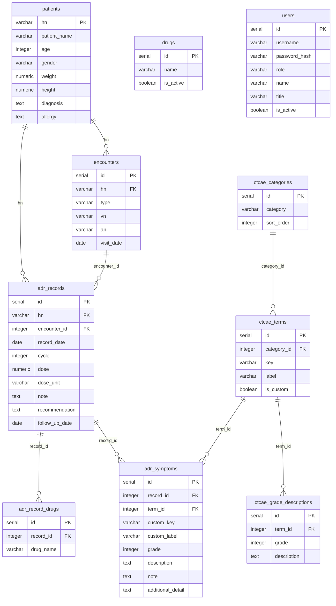

# 📋 ADR-T System — Database Schema & API Reference

> เอกสารนี้อธิบายโครงสร้างฐานข้อมูลและ API ทั้งหมดของระบบติดตามอาการไม่พึงประสงค์จากยา  
> **Base URL**: `http://localhost:5000/api`  
> **Database**: PostgreSQL (Neon — ap-southeast-1)  
> **Auth**: Bearer JWT (ส่งใน `Authorization` header ทุก request ยกเว้น `/api/auth/login`)  
> **Content-Type**: `application/json`

---

## 🗄️ Database Tables

### 1. `patients` — ข้อมูลผู้ป่วย

| Column         | Type         | PK  | Nullable | คำอธิบาย                                   |
|----------------|--------------|-----|----------|--------------------------------------------|
| `hn`           | VARCHAR      | ✅  | NO       | Hospital Number (Primary Key)              |
| `patient_name` | VARCHAR(255) |     | NO       | ชื่อ-นามสกุลผู้ป่วย                        |
| `age`          | INTEGER      |     | YES      | อายุ (ปี)                                  |
| `gender`       | VARCHAR(20)  |     | YES      | เพศ เช่น `ชาย` / `หญิง`                   |
| `weight`       | NUMERIC      |     | YES      | น้ำหนัก (kg)                               |
| `height`       | NUMERIC      |     | YES      | ส่วนสูง (cm)                               |
| `diagnosis`    | TEXT         |     | YES      | การวินิจฉัยโรค เช่น `Breast Cancer Stage III` |
| `allergy`      | TEXT         |     | YES      | ประวัติแพ้ยา                                |
| `created_at`   | TIMESTAMP    |     | YES      | วันที่เพิ่มข้อมูล (default: NOW())          |
| `updated_at`   | TIMESTAMP    |     | YES      | วันที่อัปเดตล่าสุด                          |

> ⚠️ `ON CONFLICT (hn) DO NOTHING` — ไม่ทับข้อมูลเดิมเมื่อ HN ซ้ำ

---

### 2. `users` — ผู้ใช้งานระบบ

| Column          | Type         | PK  | Nullable | คำอธิบาย                                      |
|-----------------|--------------|-----|----------|-----------------------------------------------|
| `id`            | SERIAL       | ✅  | NO       | Auto-increment ID                             |
| `username`      | VARCHAR(100) |     | NO       | ชื่อผู้ใช้งาน (unique)                        |
| `password_hash` | VARCHAR(255) |     | NO       | รหัสผ่านที่เข้ารหัสด้วย bcrypt               |
| `role`          | VARCHAR(50)  |     | NO       | บทบาท: `pharmacist` / `nurse`       |
| `name`          | VARCHAR(255) |     | YES      | ชื่อแสดงผล                                    |
| `title`         | VARCHAR(100) |     | YES      | ตำแหน่ง เช่น `เภสัชกร` / `พยาบาล`           |
| `is_active`     | BOOLEAN      |     | YES      | สถานะใช้งาน (default: true)                   |

---

### 3. `encounters` — การมาพบแพทย์ (OPD/IPD Visit)

| Column       | Type         | PK  | Nullable | คำอธิบาย                                     |
|--------------|--------------|-----|----------|----------------------------------------------|
| `id`         | SERIAL       | ✅  | NO       | Auto-increment ID                            |
| `hn`         | VARCHAR      |     | NO       | FK → `patients.hn`                           |
| `type`       | VARCHAR(10)  |     | NO       | ประเภท: `OPD` / `IPD`                        |
| `vn`         | VARCHAR(100) |     | YES      | Visit Number (OPD) รูปแบบ `VN-{timestamp}`  |
| `an`         | VARCHAR(100) |     | YES      | Admission Number (IPD) รูปแบบ `AN-{timestamp}` |
| `visit_date` | DATE         |     | NO       | วันที่มาพบแพทย์                               |
| `created_by` | VARCHAR      |     | YES      | user.id ผู้สร้าง                              |
| `created_at` | TIMESTAMP    |     | YES      | วันที่สร้าง (default: NOW())                  |

---

### 4. `adr_records` — บันทึก ADR (หัวรายการ)

| Column            | Type         | PK  | Nullable | คำอธิบาย                                      |
|-------------------|--------------|-----|----------|-----------------------------------------------|
| `id`              | SERIAL       | ✅  | NO       | Auto-increment ID                             |
| `hn`              | VARCHAR      |     | NO       | FK → `patients.hn`                            |
| `encounter_id`    | INTEGER      |     | YES      | FK → `encounters.id`                          |
| `record_date`     | DATE         |     | NO       | วันที่บันทึก ADR                              |
| `cycle`           | INTEGER      |     | YES      | รอบการรักษา (Cycle ที่เท่าไหร่)               |
| `dose`            | NUMERIC      |     | YES      | ขนาดยาที่ใช้                                  |
| `dose_unit`       | VARCHAR(50)  |     | YES      | หน่วยของยา เช่น `mg/m²` / `mg/kg` / `mg`     |
| `note`            | TEXT         |     | YES      | หมายเหตุเพิ่มเติม                             |
| `recommendation`  | TEXT         |     | YES      | คำแนะนำ / การจัดการ                           |
| `follow_up_date`  | DATE         |     | YES      | วันนัดติดตาม                                  |
| `created_by`      | VARCHAR      |     | YES      | user.id ผู้บันทึก                             |
| `updated_by`      | VARCHAR      |     | YES      | user.id ผู้แก้ไขล่าสุด                        |
| `created_at`      | TIMESTAMP    |     | YES      | วันที่สร้าง                                   |
| `updated_at`      | TIMESTAMP    |     | YES      | วันที่อัปเดตล่าสุด                            |

---

### 5. `adr_record_drugs` — รายการยาใน ADR Record

| Column      | Type        | PK  | Nullable | คำอธิบาย                     |
|-------------|-------------|-----|----------|------------------------------|
| `id`        | SERIAL      | ✅  | NO       | Auto-increment ID            |
| `record_id` | INTEGER     |     | NO       | FK → `adr_records.id`        |
| `drug_name` | VARCHAR(255)|     | NO       | ชื่อยา (free text หรือจาก `drugs`) |

---

### 6. `adr_symptoms` — รายการอาการ ADR (ทีละ symptom)

| Column             | Type         | PK  | Nullable | คำอธิบาย                                       |
|--------------------|--------------|-----|----------|------------------------------------------------|
| `id`               | SERIAL       | ✅  | NO       | Auto-increment ID                              |
| `record_id`        | INTEGER      |     | NO       | FK → `adr_records.id`                          |
| `term_id`          | INTEGER      |     | YES      | FK → `ctcae_terms.id` (null ถ้าเป็น custom)    |
| `custom_key`       | VARCHAR(255) |     | YES      | Key อาการ custom (ถ้าไม่ใช่ CTCAE มาตรฐาน)     |
| `custom_label`     | VARCHAR(255) |     | YES      | ชื่ออาการ custom                               |
| `grade`            | INTEGER      |     | NO       | ระดับความรุนแรง CTCAE Grade 1–5               |
| `description`      | TEXT         |     | YES      | คำอธิบายอาการ (ตาม grade definition)           |
| `note`             | TEXT         |     | YES      | หมายเหตุเพิ่มเติมของอาการนั้น                  |
| `additional_detail`| TEXT         |     | YES      | รายละเอียดเพิ่มเติม (ค่าแล็บ / หน่วย ฯลฯ)     |

> ทุก insert จะ `DELETE ... WHERE record_id = $1` ก่อน แล้วค่อย insert ใหม่ (upsert pattern)

---

### 7. `ctcae_categories` — หมวดหมู่ CTCAE

| Column       | Type         | PK  | Nullable | คำอธิบาย                         |
|--------------|--------------|-----|----------|----------------------------------|
| `id`         | SERIAL       | ✅  | NO       | Auto-increment ID                |
| `category`   | VARCHAR(255) |     | NO       | ชื่อหมวด เช่น `Blood`, `GI`     |
| `sort_order` | INTEGER      |     | YES      | ลำดับการแสดงผล                   |

---

### 8. `ctcae_terms` — รายการอาการ CTCAE

| Column        | Type         | PK  | Nullable | คำอธิบาย                                      |
|---------------|--------------|-----|----------|-----------------------------------------------|
| `id`          | SERIAL       | ✅  | NO       | Auto-increment ID                             |
| `category_id` | INTEGER      |     | NO       | FK → `ctcae_categories.id`                    |
| `key`         | VARCHAR(255) |     | NO       | Unique key เช่น `anemia`, `nausea`            |
| `label`       | VARCHAR(255) |     | NO       | ชื่อแสดงผล เช่น `Anemia`, `Nausea`           |
| `is_custom`   | BOOLEAN      |     | YES      | เป็น term ที่เพิ่มเองหรือไม่ (default: false) |

---

### 9. `ctcae_grade_descriptions` — คำอธิบาย Grade แต่ละระดับ

| Column        | Type    | PK  | Nullable | คำอธิบาย                              |
|---------------|---------|-----|----------|---------------------------------------|
| `id`          | SERIAL  | ✅  | NO       | Auto-increment ID                     |
| `term_id`     | INTEGER |     | NO       | FK → `ctcae_terms.id`                 |
| `grade`       | INTEGER |     | NO       | ระดับ 1–5                             |
| `description` | TEXT    |     | YES      | คำอธิบายตาม CTCAE standard            |

---

### 10. `drugs` — รายการยา (Drug Master)

| Column      | Type         | PK  | Nullable | คำอธิบาย                            |
|-------------|--------------|-----|----------|-------------------------------------|
| `id`        | SERIAL       | ✅  | NO       | Auto-increment ID                   |
| `name`      | VARCHAR(255) |     | NO       | ชื่อยา (unique)                     |
| `is_active` | BOOLEAN      |     | YES      | สถานะใช้งาน (default: true)         |

---

### 11. `view_adr_summary` — View สรุป ADR Records

View นี้ JOIN ข้อมูลจาก `adr_records`, `patients`, `encounters`, `adr_symptoms` และ `adr_record_drugs` ไว้ในที่เดียว ใช้สำหรับ query หน้า Records และ Dashboard

| Column             | คำอธิบาย                                            |
|--------------------|-----------------------------------------------------|
| `id`               | adr_records.id                                     |
| `hn`               | HN ผู้ป่วย                                          |
| `patient_name`     | ชื่อผู้ป่วย                                          |
| `diagnosis`        | การวินิจฉัย                                          |
| `record_date`      | วันที่บันทึก                                         |
| `cycle`            | รอบการรักษา                                          |
| `dose` / `dose_unit` | ขนาดยาและหน่วย                                    |
| `note` / `recommendation` / `follow_up_date` | ข้อมูลติดตาม               |
| `drugs`            | array ชื่อยา                                         |
| `max_grade`        | grade สูงสุดของ record นั้น                           |
| `symptom_count`    | จำนวนอาการทั้งหมด                                   |
| `grade3_plus_count`| จำนวนอาการ grade ≥ 3                                 |
| `symptoms`         | JSONB สรุปอาการทุก symptom                           |
| `encounter_id` / `encounter_type` | ข้อมูล encounter                     |
| `created_by` / `created_at` / `updated_at` | metadata                   |

---

## 🔌 API Endpoints

> ทุก endpoint (ยกเว้น `/api/auth/login`) ต้องส่ง `Authorization: Bearer <token>`

---

### AUTH

| Method | Endpoint         | Auth | คำอธิบาย            |
|--------|------------------|------|---------------------|
| POST   | `/api/auth/login`| ❌   | เข้าสู่ระบบ          |
| GET    | `/api/auth/me`   | ✅   | ดึงข้อมูล user ปัจจุบัน |

**POST `/api/auth/login`** — Body:
```json
{ "username": "pharmacist01", "password": "secret" }
```

Response:
```json
{
  "token": "eyJ...",
  "user": { "id": 1, "role": "pharmacist", "name": "ภญ.สมใจ", "title": "เภสัชกร" }
}
```

> Token มีอายุ **8 ชั่วโมง** (กำหนดใน `JWT_EXPIRES`)

---

### PATIENTS — ผู้ป่วย

| Method | Endpoint              | Role          | คำอธิบาย                     |
|--------|-----------------------|---------------|------------------------------|
| GET    | `/api/patients`       | ทุก role      | ดึงรายชื่อผู้ป่วย / ค้นหา    |
| GET    | `/api/patients/:hn`   | ทุก role      | ดึงข้อมูลผู้ป่วยรายบุคคล      |
| POST   | `/api/patients`       | pharmacist    | เพิ่มผู้ป่วยใหม่              |
| PUT    | `/api/patients/:hn`   | pharmacist    | แก้ไขข้อมูลผู้ป่วย            |

**GET `/api/patients?q=`** — Query Params:

| Param | Type   | คำอธิบาย                           |
|-------|--------|------------------------------------|
| `q`   | string | ค้นหาจาก HN หรือชื่อ (ILIKE)      |

**POST `/api/patients`** — Body:
```json
{
  "hn": "67001",
  "patient_name": "นางสาวสมหญิง ใจดี",
  "age": 52,
  "gender": "หญิง",
  "weight": 58,
  "height": 162,
  "diagnosis": "Breast Cancer Stage III HER2+"
}
```

> `hn` และ `patient_name` เป็น required field

---

### ENCOUNTERS — การมาพบแพทย์

| Method | Endpoint          | คำอธิบาย                             |
|--------|-------------------|--------------------------------------|
| POST   | `/api/encounters` | สร้าง encounter ใหม่ (OPD/IPD)       |
| GET    | `/api/encounters?hn=` | ดึง encounter ทั้งหมดของผู้ป่วย  |

**POST `/api/encounters`** — Body:
```json
{
  "hn": "67001",
  "type": "OPD",
  "visit_date": "2025-06-01"
}
```

Response:
```json
{
  "message": "สร้าง encounter สำเร็จ",
  "encounter": {
    "id": 42,
    "hn": "67001",
    "type": "OPD",
    "vn": "VN-1717200000000",
    "an": null,
    "visit_date": "2025-06-01"
  }
}
```

---

### ADR RECORDS — บันทึก ADR

| Method | Endpoint               | Role       | คำอธิบาย                        |
|--------|------------------------|------------|----------------------------------|
| GET    | `/api/records`         | ทุก role   | ดึง ADR records (filter ได้)    |
| GET    | `/api/records/:id`     | ทุก role   | ดึง record รายบุคคล              |
| POST   | `/api/records`         | ทุก role   | บันทึก ADR record ใหม่           |
| PUT    | `/api/records/:id`     | ทุก role   | แก้ไข ADR record                 |
| DELETE | `/api/records/:id`     | pharmacist | ลบ ADR record                    |

**GET `/api/records`** — Query Params:

| Param   | Type   | Format    | คำอธิบาย                                    |
|---------|--------|-----------|---------------------------------------------|
| `hn`    | string |           | กรองตาม HN ผู้ป่วย                          |
| `month` | string | `YYYY-MM` | กรองตามเดือน (ใช้ใน Dashboard / Records)   |
| `year`  | string | `YYYY`    | กรองทั้งปี (ใช้ใน Report page)             |
| `grade` | number | `1`–`5`   | กรอง record ที่มี max_grade ≥ ค่านี้        |
| `q`     | string |           | ค้นหาจาก HN หรือชื่อผู้ป่วย                |

**POST `/api/records`** — Body:
```json
{
  "hn": "67001",
  "encounter_id": 42,
  "record_date": "2025-06-01",
  "cycle": 3,
  "dose": 120,
  "dose_unit": "mg/m²",
  "drugs": ["Docetaxel", "Carboplatin"],
  "symptoms": {
    "anemia": {
      "grade": 2,
      "description": "Hgb <10.0 - 8.0 g/dL",
      "note": "Hgb 9.2",
      "additionalDetail": "",
      "label": "Anemia",
      "isCustom": false
    },
    "nausea": {
      "grade": 1,
      "description": "Loss of appetite without alteration in eating habits",
      "note": "",
      "label": "Nausea",
      "isCustom": false
    }
  },
  "note": "ผู้ป่วยทนยาได้ปานกลาง",
  "recommendation": "ให้ antiemetic เพิ่ม",
  "follow_up_date": "2025-06-15"
}
```

> `hn` และ `record_date` เป็น required field  
> ถ้าไม่ส่ง `encounter_id` ระบบจะหา encounter ล่าสุดของ HN นั้นที่ตรงกับ `record_date` อัตโนมัติ

**Response ของ GET `/api/records/:id`** (รวม symptomsDetail):
```json
{
  "id": 101,
  "hn": "67001",
  "patient_name": "นางสาวสมหญิง ใจดี",
  "record_date": "2025-06-01",
  "max_grade": 2,
  "symptom_count": 2,
  "grade3_plus_count": 0,
  "drugs": ["Docetaxel", "Carboplatin"],
  "symptoms": { ... },
  "symptomsDetail": [
    {
      "id": 201,
      "record_id": 101,
      "term_id": 5,
      "term_key": "anemia",
      "term_label": "Anemia",
      "grade": 2,
      "description": "Hgb <10.0 - 8.0 g/dL",
      "note": "Hgb 9.2",
      "additional_detail": null,
      "custom_key": null,
      "custom_label": null
    }
  ]
}
```

---

### CTCAE

| Method | Endpoint           | คำอธิบาย                                      |
|--------|--------------------|-----------------------------------------------|
| GET    | `/api/ctcae`       | ดึงข้อมูล CTCAE ทั้งหมด จัดกลุ่มตาม category |
| GET    | `/api/ctcae/terms` | ดึง term list แบบ flat array                  |

**GET `/api/ctcae?q=`** — Response:
```json
[
  {
    "category": "Blood",
    "terms": [
      {
        "id": 1,
        "key": "anemia",
        "label": "Anemia",
        "isCustom": false,
        "options": [
          { "grade": 1, "description": "Hemoglobin <LLN - 10.0 g/dL" },
          { "grade": 2, "description": "Hgb <10.0 - 8.0 g/dL" }
        ]
      }
    ]
  }
]
```

---

### DRUGS — รายการยา

| Method | Endpoint      | คำอธิบาย                              |
|--------|---------------|---------------------------------------|
| GET    | `/api/drugs`  | ดึงรายการยาที่ active ทั้งหมด          |
| POST   | `/api/drugs`  | เพิ่มยานอกบัญชีใหม่ (บันทึกลง DB ถาวร) |

**POST `/api/drugs`** — Body:
```json
{ "name": "Pembrolizumab" }
```

---

### STATS — Dashboard

| Method | Endpoint      | คำอธิบาย                                       |
|--------|---------------|------------------------------------------------|
| GET    | `/api/stats`  | ดึงสถิติสรุปสำหรับ Dashboard                   |

**GET `/api/stats?month=YYYY-MM`** — Response:
```json
{
  "month": "2025-06",
  "totalRecords": 48,
  "totalADR": 112,
  "uniquePatients": 35,
  "adrRate": 2.3333,
  "grade3Events": 8,
  "grade3Rate": 16.67,
  "gradeDist": { "1": 55, "2": 40, "3": 12, "4": 4, "5": 1 },
  "topSymptoms": [
    { "name": "Nausea", "count": 22 },
    { "name": "Anemia", "count": 18 }
  ],
  "trend": [
    { "month": "2025-01", "total_records": 40, "total_adr": 90, "grade3_events": 5 }
  ],
  "prev": { "month": "2025-05", "totalRecords": 45, "totalADR": 100 },
  "allTime": { "totalRecords": 520, "totalADR": 1200, "grade3Events": 75 }
}
```

---

### REPORT

| Method | Endpoint                      | คำอธิบาย                                          |
|--------|-------------------------------|---------------------------------------------------|
| GET    | `/api/report/available-years` | ดึงรายปีที่มีข้อมูล ADR                            |
| GET    | `/api/report/symptoms`        | ดึง symptom matrix จัดกลุ่มตามเดือน (สำหรับรายงาน) |

**GET `/api/report/symptoms?year=2025&grade=3`** — Query Params:

| Param   | Type   | คำอธิบาย                                                  |
|---------|--------|-----------------------------------------------------------|
| `year`  | number | ปีที่ต้องการ (required)                                    |
| `grade` | string | กรองเฉพาะ grade ที่กำหนด (`3` = grade ≥ 3) (optional)    |

Response:
```json
{
  "matrix": {
    "Nausea": { "2025-01": 5, "2025-02": 3 },
    "Anemia": { "2025-01": 2, "2025-02": 4 }
  },
  "symptomTotals": { "Nausea": 18, "Anemia": 12 },
  "monthTotals": { "2025-01": 20, "2025-02": 15 },
  "grandTotal": 120
}
```

---

### UTILITY ENDPOINT

| Method | Endpoint                          | Role       | คำอธิบาย                                        |
|--------|-----------------------------------|------------|-------------------------------------------------|
| POST   | `/api/records/backfill-encounters`| pharmacist | แก้ record เก่าที่ `encounter_id = NULL` อัตโนมัติ |

---

## 📊 ER Diagram



---

## ⚙️ Environment Variables

```env
# Neon PostgreSQL (ap-southeast-1)
PGHOST=ep-winter-boat-aojx3buy-pooler.c-2.ap-southeast-1.aws.neon.tech
PGPORT=5432
PGDATABASE=neondb
PGUSER=neondb_owner
PGPASSWORD=<your_password>

# JWT
JWT_SECRET=<your_secret>
JWT_EXPIRES=8h

# Server
PORT=5000
```

---

## 🔐 Auth & Role Matrix

| Endpoint                  | ทุก role | pharmacist เท่านั้น |
|---------------------------|----------|---------------------|
| GET /api/patients         | ✅       |                     |
| POST /api/patients        |          | ✅                  |
| PUT /api/patients/:hn     |          | ✅                  |
| GET /api/records          | ✅       |                     |
| POST /api/records         | ✅       |                     |
| PUT /api/records/:id      | ✅       |                     |
| DELETE /api/records/:id   |          | ✅                  |
| POST /api/encounters      | ✅       |                     |
| GET /api/stats            | ✅       |                     |
| GET /api/report/*         | ✅       |                     |
| POST backfill-encounters  |          | ✅                  |

---

> 📌 **หมายเหตุ**: เอกสารนี้สร้างจาก codebase ของ ADR-T System v2.0.0  
> Database: Neon PostgreSQL · ฝ่ายเภสัชกรรม โรงพยาบาลกรุงเทพสิริโรจน์